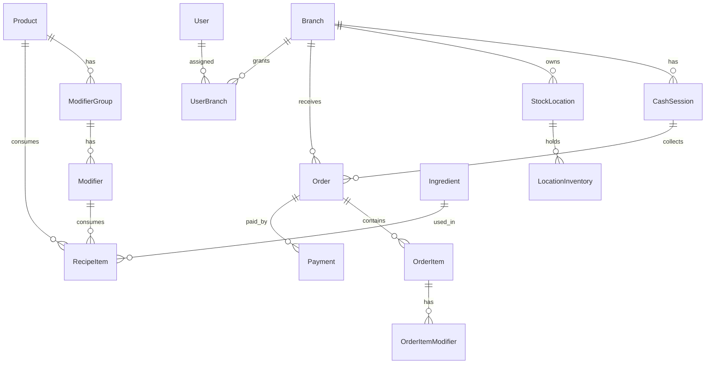

# Koi POS — Contexto Completo de la Aplicación

Documento de referencia para desarrolladores, agentes y operadores. Describe el propósito, arquitectura, módulos, reglas de negocio, flujos y estado actual del V1.

**Última actualización:** junio 2026  
**Versión:** V1 (piloto single-business, multisucursal)

---

## Tabla de contenidos

1. [Visión y propósito](#1-visión-y-propósito)
2. [Alcance V1 vs visión futura](#2-alcance-v1-vs-visión-futura)
3. [Stack tecnológico](#3-stack-tecnológico)
4. [Arquitectura del sistema](#4-arquitectura-del-sistema)
5. [Modelo de datos](#5-modelo-de-datos)
6. [Módulos funcionales](#6-módulos-funcionales)
7. [Lógica de dominio](#7-lógica-de-dominio)
8. [Rutas y pantallas](#8-rutas-y-pantallas)
9. [Capa servidor](#9-capa-servidor)
10. [Roles, permisos y sesión](#10-roles-permisos-y-sesión)
11. [Flujos operativos](#11-flujos-operativos)
12. [Reglas de negocio críticas](#12-reglas-de-negocio-críticas)
13. [Datos demo y catálogo empírico](#13-datos-demo-y-catálogo-empírico)
14. [Pruebas y calidad](#14-pruebas-y-calidad)
15. [Configuración y despliegue local](#15-configuración-y-despliegue-local)
16. [Mapa de archivos](#16-mapa-de-archivos)

---

## 1. Visión y propósito

**Koi POS** es un sistema de punto de venta (POS) cloud-first, optimizado para **productos altamente personalizables** — originalmente diseñado para un kiosco de fresas cubiertas de chocolate en Guatemala, pero con arquitectura **agnóstica al producto** (puede escalar a otros rubros).

### Objetivos operativos

- Eliminar fricción en pedidos con muchas opciones (bases, toppings, extras).
- Permitir venta rápida en tablet con flujo de pocos toques.
- Integrar preparación de pedidos en la misma pantalla del kiosco (sin KDS separado en V1).
- Descontar inventario atómicamente según recetas al cobrar.
- Dar visibilidad al dueño: ventas, métodos de pago, productos populares, stock.

### Objetivos técnicos

- Monolito Next.js con separación clara: **dominio puro**, **servicios**, **UI**.
- Backend recalcula precios y totales; el cliente solo estima para UX.
- Catálogo y precios globales; inventario, caja y órdenes por sucursal.
- UI 100% en español para usuarios finales.

### Moneda y contexto fiscal (Guatemala)

- Moneda: **Quetzales (Q)**.
- Cliente por defecto: **Consumidor Final (CF)** con NIT `CF`.
- Campos FEL en esquema (`felUuid`, `felDteNumber`, `felCertifiedAt`) como **placeholders** — sin integración FEL real en V1.

---

## 2. Alcance V1 vs visión futura

El PRD original (`docs/requirements.md`) describe una visión SaaS multi-tenant con KDS, gastos, utilidad neta y analytics avanzados. **V1 implementa un subconjunto deliberado:**

| Característica | V1 | Futuro |
| --- | --- | --- |
| Multi-tenancy (`business_id`) | No | Sí |
| KDS separado | No — preparación en `/kiosk` | Módulo dedicado |
| FEL real | Solo placeholders | Integración |
| Gastos / utilidad neta | Sí (Fase 1) | Sí |
| Stock negativo en venta | Permitido (alerta en UI) | Configurable |
| Catálogo global | Sí | Sí |
| Inventario por sucursal | Sí | Sí |
| Import/export Excel histórico | No (T10.5 pendiente) | Opcional post-launch |
| Transferencia como método de pago | Sí (extra vs Excel operativo) | — |

---

## 3. Stack tecnológico

| Capa | Tecnología |
| --- | --- |
| Framework | Next.js 16 (App Router, Server Components, Server Actions) |
| Lenguaje | TypeScript 5.9 |
| UI | React 19, Tailwind CSS 4, componentes locales estilo shadcn/ui |
| Base de datos | PostgreSQL + Prisma 6 |
| Auth | Sesión firmada con cookie HTTP-only (`bcryptjs` para passwords) |
| Validación | Zod (formularios), funciones puras de dominio |
| Tests unitarios | Vitest |
| Tests E2E | Playwright (viewport tablet 768×1024) |
| Fuente UI | Nunito + Fraunces, tema pastel durazno/mint/lila |

### Scripts npm relevantes

```bash
npm run dev          # Servidor de desarrollo
npm run build        # prisma generate + next build
npm run db:generate  # Generar cliente Prisma
npm run db:migrate   # Migraciones
npm run db:seed      # Datos demo
npm test             # Vitest
npm run test:e2e     # Playwright
npm run typecheck    # tsc --noEmit
npm run lint         # ESLint
```

---

## 4. Arquitectura del sistema

```
┌─────────────────────────────────────────────────────────────┐
│                     Browser (Tablet / Desktop)              │
│  React Client Components (kiosk-client) + Server Components │
└──────────────────────────┬──────────────────────────────────┘
                           │ Server Actions / Forms
┌──────────────────────────▼──────────────────────────────────┐
│  src/server/                                                │
│  ├── auth.ts          Guards: requireUser, requireRole        │
│  ├── actions/         Server Actions (mutaciones)           │
│  ├── services/        Orquestación + transacciones          │
│  ├── queries/         Lecturas (catálogo, settings)         │
│  └── reports/         Reportes especializados               │
└──────────────────────────┬──────────────────────────────────┘
                           │
┌──────────────────────────▼──────────────────────────────────┐
│  src/domain/          Lógica pura (sin I/O)                 │
│  cart.ts, cash.ts, inventory.ts, order-status.ts            │
└──────────────────────────┬──────────────────────────────────┘
                           │
┌──────────────────────────▼──────────────────────────────────┐
│  Prisma Client → PostgreSQL                                 │
└─────────────────────────────────────────────────────────────┘
```

### Principios de diseño

1. **Dominio primero:** totales, validación de modificadores, inventario y caja viven en `src/domain/` como funciones puras testeables.
2. **Backend autoritativo:** `preparePaidOrder()` recalcula líneas, totales y pagos antes de persistir.
3. **Snapshots históricos:** `OrderItem` y `OrderItemModifier` guardan nombres y precios al momento de la venta.
4. **Sin API REST separada:** V1 usa Server Actions; la arquitectura permite extraer API después.
5. **Preservación de tokens:** leer módulos específicos, no volcar archivos enteros en agentes.

---

## 5. Modelo de datos

### Entidades principales

#### Organización y acceso

| Modelo | Propósito |
| --- | --- |
| `Branch` | Sucursal (código único, dirección, activa/inactiva) |
| `User` | Usuario con email, password hash, rol (`ADMIN` \| `OPERATOR`) |
| `UserBranch` | Relación N:M usuario ↔ sucursales permitidas |

#### Caja

| Modelo | Propósito |
| --- | --- |
| `CashSession` | Turno de caja por sucursal: apertura, cierre, montos esperado/contado/diferencia |

Estados: `OPEN` → `CLOSED`. Solo una sesión abierta por sucursal a la vez.

#### Catálogo (global)

| Modelo | Propósito |
| --- | --- |
| `Product` | Producto base con precio, orden, activo |
| `ModifierGroup` | Grupo de opciones (obligatorio/opcional, min/max selecciones) |
| `Modifier` | Opción con `priceDelta` incremental |
| `Ingredient` | Insumo con unidad, costo, umbral bajo stock |
| `RecipeItem` | Receta: cantidad de ingrediente por producto **o** modificador |

**Motor de recetas:** un producto vendido puede consumir ingredientes del producto base y de cada modificador seleccionado.

#### Inventario (bodega central + quiosco por sucursal)

| Modelo | Propósito |
| --- | --- |
| `StockLocation` | Ubicaciones de stock: una `BODEGA` central (sin sucursal) + un `QUIOSCO` por sucursal |
| `LocationInventory` | Stock actual por ingrediente y ubicación |
| `InventoryMovement` | Auditoría por ubicación: `PURCHASE`, `WASTE`, `ADJUSTMENT`, `SALE`, `TRANSFER` (las dos piernas de un traslado se agrupan por `transferId`) |

Las ventas consumen el quiosco de la sucursal; los traslados mueven stock de la bodega central al quiosco.

#### Ventas

| Modelo | Propósito |
| --- | --- |
| `Customer` | Cliente fiscal (NIT único, nombre, teléfono) |
| `Order` | Orden con totales, estado, datos cliente, placeholders FEL |
| `OrderItem` | Línea con snapshots de producto/precio |
| `OrderItemModifier` | Modificadores elegidos con snapshots |
| `Payment` | Pago por método (`CASH`, `CARD`, `TRANSFER`), monto, vuelto |

Estados de orden: `PENDING` → `PREPARING` → `DELIVERED` | `CANCELLED`

#### Configuración

| Modelo | Propósito |
| --- | --- |
| `AppSettings` | Fila singleton (`id: "global"`): nombre empresa, colores, moneda, retícula táctil de modificadores |

### Diagrama de relaciones (simplificado)



---

## 6. Módulos funcionales

### 6.1 Autenticación y sucursal

**Propósito:** Identificar al usuario y acotar todas las operaciones a una sucursal activa.

**Funciones:**
- Login con email/password (`loginAction`)
- Logout (`logoutAction`)
- Sesión firmada HMAC-SHA256 en cookie `koi_session` (12 h por defecto, configurable vía `SESSION_TTL_HOURS`)
- Selector de sucursal si el usuario tiene más de una (`/select-branch`)
- Auto-selección si solo tiene una sucursal

**Archivos clave:** `src/lib/session.ts`, `src/server/auth.ts`, `src/server/actions/auth-actions.ts`

---

### 6.2 Caja (Cash Sessions)

**Propósito:** Controlar turnos de efectivo — no se puede vender sin caja abierta.

**Funciones:**
- **Apertura** (`/cash/open`): monto inicial obligatorio, notas opcionales
- **Detección:** `/kiosk` redirige a `/cash/open` si no hay sesión `OPEN`
- **Cierre** (`/cash/close`): resumen por método de pago, efectivo esperado vs contado, diferencia
- **Fórmula efectivo esperado:** `monto_inicial + ventas_en_efectivo`

**Archivos clave:** `src/domain/cash.ts`, `src/server/services/cash.ts`, `src/server/actions/cash-actions.ts`

---

### 6.3 Catálogo y recetas (Admin)

**Propósito:** Definir qué se vende y qué insumos consume cada combinación.

**Funciones (CRUD completo con edición inline):**

| Entidad | Operaciones |
| --- | --- |
| Productos | Crear, editar, activar/desactivar, eliminar si sin historial |
| Grupos de modificadores | min/max selecciones, obligatorio, por producto |
| Modificadores | `priceDelta`, orden, activo |
| Ingredientes | unidad, costo, umbral bajo stock |
| Recetas | Vincular ingrediente + cantidad a producto o modificador |

**Reglas de eliminación:** si hay dependencias (órdenes, movimientos), se **desactiva** en lugar de borrar (`chooseRemovalMode`).

**Pantallas:** `/admin/catalog`, `/admin/ingredients`

**Archivos clave:** `src/server/actions/admin-actions.ts`, `src/server/admin-crud.ts`

---

### 6.4 Kiosco / POS

**Propósito:** Pantalla principal de venta y preparación, optimizada para tablet.

**Funciones:**

#### Venta
- Catálogo táctil de productos activos
- Constructor de producto con grupos obligatorios/opcionales
- Validación min/max de selecciones (cliente + servidor)
- Carrito editable: agregar, editar línea existente, eliminar
- Límite: 60 líneas, 99 unidades por línea
- Cobro con efectivo, tarjeta y/o transferencia (pagos divididos)
- Cálculo de vuelto en tiempo real
- Cliente CF por defecto; NIT, nombre y teléfono opcionales
- Upsert de `Customer` si NIT ≠ CF

#### Preparación (integrada)
- Panel de pedidos activos (`PENDING`, `PREPARING`)
- Avance de estado: Pendiente → Preparando → Entregado
- Cancelación con razón (no en órdenes `DELIVERED`/`CANCELLED`)
- Detalle de modificadores por ítem

#### UX
- Tema pastel durazno, sidebar fijo
- Retícula táctil grande para modificadores (configurable en ajustes)
- Limpieza automática del carrito tras venta exitosa
- Hora de apertura de caja formateada para Guatemala (sin bugs de hidratación)

**Archivos clave:** `src/app/kiosk/page.tsx`, `src/components/kiosk/kiosk-client.tsx`, `src/server/queries/catalog.ts`

---

### 6.5 Inventario

**Propósito:** Stock por sucursal con trazabilidad de movimientos.

**Funciones:**
- **Descuento automático** al pagar orden (tipo `SALE`, cantidad negativa)
- **Stock negativo permitido** — se muestra alerta visual bajo/negativo
- **Movimientos manuales:** compra, merma, ajuste
- **Anulación** de movimiento manual con ajuste inverso
- Vista de stock actual + últimos 20 movimientos

**Resolución de uso:** `resolveOrderIngredientUsage()` suma recetas del producto + modificadores × cantidad vendida.

**Pantalla:** `/admin/inventory`

**Archivos clave:** `src/domain/inventory.ts`, `src/server/services/orders.ts` (descuento en transacción)

---

### 6.6 Reportes

**Propósito:** Inteligencia operativa para el administrador.

**Funciones:**
- Filtro por rango de fechas
- Métricas: total ventas, cantidad órdenes, desglose efectivo/tarjeta+transferencia
- Top 10 productos por cantidad
- Top 10 modificadores por uso
- **Reporte diario empírico** — replica mentalmente la hoja `Diario ventas` del Excel operativo (`Control ventas - Infinito .xlsx`):
  - Secciones: VASOS, TOPPINGS, EXTRA TOPPING, EXTRA BASES, EXTRAS
  - Conteos por método de pago por ítem
- **Exportación CSV** de órdenes con ítems, modificadores y pagos

**Pantallas:** `/admin/reports`, `/admin/reports/export` (GET)

**Archivos clave:** `src/server/reports/empirical-daily.ts`, `src/app/admin/reports/page.tsx`

---

### 6.7 Administración

**Propósito:** Back-office para dueño/administrador.

| Sección | Ruta | Funciones |
| --- | --- | --- |
| Panel | `/admin` | Enlaces a todos los módulos |
| Sucursales | `/admin/branches` | CRUD, activar/desactivar |
| Usuarios | `/admin/users` | CRUD, roles, asignación sucursales, passwords |
| Catálogo | `/admin/catalog` | Productos, grupos, modificadores, recetas |
| Ingredientes | `/admin/ingredients` | Insumos |
| Inventario | `/admin/inventory` | Stock y movimientos |
| Reportes | `/admin/reports` | Analytics |
| Gastos | `/admin/expenses` | Gastos puntuales y recurrentes |
| Finanzas | `/admin/finance` | P&L: ingresos, COGS, OPEX, utilidad neta, rentabilidad por producto |
| Ajustes | `/admin/settings` | Branding, colores, moneda, retícula modificadores |

---

### 6.8 Ajustes del sistema

**Propósito:** Personalización visual y comportamiento del kiosco.

**Campos configurables (`AppSettings`):**
- `companyName` — nombre en sidebar
- `currencySymbol` — símbolo (default `Q`)
- `accentColor`, `sidebarColor`, `backgroundColor`
- `logoUrl` (opcional)
- `modifierGridEnabled` — tarjetas grandes para modificadores

---

### 6.9 Gastos (OPEX)

**Propósito:** Registrar el gasto operativo del negocio para el cálculo de utilidad.

**Funciones:**
- Gastos **puntuales**: descripción, monto, categoría, fecha; eliminar.
- Gastos **recurrentes**: plantilla activable/desactivable que se expande al periodo en finanzas.
- Filtro por categoría/fecha.

**Pantalla:** `/admin/expenses` · **Archivos:** `src/server/actions/expense-actions.ts`, `src/domain/expenses.ts`

---

### 6.10 Finanzas (P&L)

**Propósito:** Estado de resultados del periodo para el dueño (alcance V1, Fase 1).

**Funciones:**
- Filtro por rango de fechas.
- Ingresos (ventas no canceladas), **COGS** (costo de recetas vendidas), **OPEX** (gastos +
  recurrentes), **utilidad neta**.
- **Rentabilidad por producto** (margen por ítem vendido).

**Pantalla:** `/admin/finance` · **Archivos:** `src/domain/finance.ts`, `src/domain/costing.ts`

---

## 7. Lógica de dominio

Toda la lógica crítica vive en `src/domain/` y se reutiliza en cliente (preview) y servidor (autoridad).

### 7.1 Carrito y cobro (`cart.ts`)

| Función | Responsabilidad |
| --- | --- |
| `validateModifierSelections()` | Reglas min/max, obligatorios, sin duplicados |
| `calculateCartItemTotal()` | `(basePrice + Σ priceDelta) × quantity` |
| `calculateOrderTotals()` | Subtotal, descuento (0 en V1), impuesto (0 en V1), total |
| `validatePayments()` | Monto exacto al total, un pago por método, efectivo recibido ≥ monto |
| `validateCheckout()` | Carrito no vacío, límites, pagos válidos |
| `calculateCashChange()` | Vuelto = recibido − monto efectivo |
| `calculateCashPaymentFromReceived()` | Infieren monto efectivo desde lo recibido menos tarjeta/transferencia |
| `calculateChangeBreakdown()` | Desglose de vuelto en denominaciones GTQ |
| `sanitizeOrderNote()` | Limpia HTML, control chars, longitud máxima |
| `roundMoney()` | Redondeo a 2 decimales |
| `buildSaleSuccessPath()` | Redirect post-venta con token de éxito |

**Constantes:** `MAX_CART_LINES=60`, `MAX_ITEM_QUANTITY=99`, `MAX_MONEY_AMOUNT=999999.99`

### 7.2 Caja (`cash.ts`)

| Función | Responsabilidad |
| --- | --- |
| `calculateCashSessionSummary()` | Ventas efectivo, esperado, diferencia |
| `validateCashSessionAmounts()` | Montos válidos ≥ 0 con precisión de centavos |

### 7.3 Inventario (`inventory.ts`)

| Función | Responsabilidad |
| --- | --- |
| `resolveOrderIngredientUsage()` | Mapa ingrediente → cantidad total a descontar |
| `isLowOrNegativeStock()` | Alerta si stock ≤ umbral |
| `validateManualInventoryMovement()` | Tipo, cantidad, precisión 3 decimales |
| `calculateManualInventoryDelta()` | Merma siempre negativa |

### 7.4 Estados de orden (`order-status.ts`)

| Función | Responsabilidad |
| --- | --- |
| `validateOrderStatusTransition()` | Máquina de estados estricta |
| `isOrderStatusValue()` | Type guard |

**Transiciones permitidas:**
```
PENDING → PREPARING → DELIVERED
(cualquier activo) → CANCELLED (acción separada)
```

---

## 8. Rutas y pantallas

| Ruta | Acceso | Descripción |
| --- | --- | --- |
| `/` | Auth | Redirect a `/kiosk` |
| `/login` | Público | Inicio de sesión |
| `/select-branch` | Auth | Elegir sucursal activa |
| `/kiosk` | Auth + caja abierta | POS + preparación |
| `/cash/open` | Auth | Abrir caja |
| `/cash/close` | Auth | Cerrar caja |
| `/admin` | ADMIN | Panel administración |
| `/admin/branches` | ADMIN | Sucursales |
| `/admin/users` | ADMIN | Usuarios |
| `/admin/catalog` | ADMIN | Catálogo y recetas |
| `/admin/ingredients` | ADMIN | Ingredientes |
| `/admin/inventory` | ADMIN | Inventario |
| `/admin/reports` | ADMIN | Reportes |
| `/admin/reports/export` | ADMIN | CSV download (rate-limit 10/min, rango máx. 31 días) |
| `/admin/expenses` | ADMIN | Gastos (puntuales y recurrentes) |
| `/admin/finance` | ADMIN | Finanzas (P&L) |
| `/admin/settings` | ADMIN | Ajustes globales |

### Navegación (`AppShell`)

| Enlace | Rol |
| --- | --- |
| Kiosco | Todos |
| Caja | Todos |
| Administración | ADMIN |
| Reportes | ADMIN |
| Gastos | ADMIN |
| Finanzas | ADMIN |
| Ajustes | ADMIN |

**OPERATOR** solo ve Kiosco y Caja; intentos de acceder a `/admin/*` redirigen a `/kiosk`.

---

## 9. Capa servidor

### 9.1 Server Actions

| Archivo | Acciones |
| --- | --- |
| `auth-actions.ts` | `loginAction`, `logoutAction`, `setActiveBranchAction` |
| `cash-actions.ts` | `openCashSessionAction`, `closeCashSessionAction`, `getOpenCashSession`, `ensureCashSessionForKiosk` |
| `order-actions.ts` | `createPaidOrderAction`, `changeOrderStatusAction`, `cancelOrderAction` |
| `admin-actions.ts` | CRUD sucursales, usuarios, catálogo, recetas, inventario, settings |

### 9.2 Servicios

| Archivo | Responsabilidad |
| --- | --- |
| `services/orders.ts` | `preparePaidOrder()` — valida y precifica; `createPaidOrderInTransaction()` — persiste orden, pagos, descuenta inventario |
| `services/cash.ts` | `prepareCashSessionClose()` — valida y calcula resumen de cierre |

### 9.3 Queries (lectura)

| Archivo | Responsabilidad |
| --- | --- |
| `queries/catalog.ts` | `listSellableProducts()` — productos activos con grupos/modificadores activos |
| `queries/settings.ts` | `getAppSettings()` — singleton con defaults |

### 9.4 Flujo de creación de orden (transacción)

```
createPaidOrderAction
  ├─ getActiveBranch() + getOpenCashSession()
  ├─ listSellableProducts() + recipeItems
  ├─ preparePaidOrder()          ← dominio puro
  └─ prisma.$transaction
       └─ createPaidOrderInTransaction()
            ├─ order + items + modifiers (snapshots)
            ├─ payments + changeAmount
            └─ locationInventory (quiosco) decrement + SALE movements
```

---

## 10. Roles, permisos y sesión

### Roles

| Rol | Permisos |
| --- | --- |
| `ADMIN` | Todo: kiosco, caja, back-office, reportes, ajustes |
| `OPERATOR` | Kiosco, caja, preparación de pedidos |

### Sesión

- Cookie: `koi_session` (HTTP-only, SameSite=lax, secure en producción)
- Payload: `{ userId, activeBranchId?, expiresAt }`
- Firma: HMAC-SHA256 con `SESSION_SECRET`
- Duración: **12 horas** por defecto, configurable con `SESSION_TTL_HOURS` (acotado 1–24 h)

### Guards

| Función | Comportamiento |
| --- | --- |
| `requireUser()` | Sin sesión → `/login` |
| `requireRole([ADMIN])` | Rol incorrecto → `/kiosk` |
| `getActiveBranch()` | Sin sucursal → `/select-branch` |

---

## 11. Flujos operativos

### 11.1 Rutina diaria del piloto

1. Iniciar sesión
2. Seleccionar sucursal (si aplica)
3. Abrir caja con monto inicial
4. Vender desde kiosco
5. Avanzar pedidos: Pendiente → Preparando → Entregado
6. Registrar compras/mermas/ajustes de inventario si aplica
7. Cerrar caja con conteo físico
8. Revisar reportes y exportar CSV

### 11.2 Flujo de venta (kiosco)

```
Seleccionar producto
  → Elegir modificadores (validar reglas)
  → Agregar al carrito (o editar línea existente)
  → Repetir para más productos
  → Capturar pagos (efectivo/tarjeta/transferencia)
  → Opcional: NIT, nombre, teléfono
  → Cobrar (server recalcula todo)
  → Redirect /kiosk?ok=venta&order={id}
  → Carrito se limpia
  → Orden aparece en panel de preparación
```

### 11.3 Flujo de caja

```
Sin sesión OPEN → /cash/open
  → Ingresar monto inicial → /kiosk

Fin de turno → /cash/close
  → Ver resumen (efectivo, tarjeta, transferencia)
  → Ingresar efectivo contado
  → Cerrar → /cash/open (nueva apertura requerida)
```

---

## 12. Reglas de negocio críticas

1. **No vender sin caja abierta** — enforced en `/kiosk` y `createPaidOrderAction`.
2. **Backend recalcula precios** — el cliente no es fuente de verdad.
3. **No bloquear por stock insuficiente** — se permite negativo; se alerta en inventario.
4. **Un pago por método** — no duplicar CASH/CARD/TRANSFER en la misma orden.
5. **Pago exacto al total** — ni menor ni mayor.
6. **Efectivo recibido ≥ monto en efectivo** — para calcular vuelto.
7. **Snapshots en órdenes** — cambios de catálogo no alteran historial.
8. **Órdenes canceladas** — excluidas de reportes y cierre de caja.
9. **Eliminación segura** — desactivar si hay dependencias históricas.
10. **UI en español** — labels, errores, enums visibles traducidos (`lib/labels.ts`).
11. **Sin multi-tenancy** — un solo negocio, múltiples sucursales.
12. **Datos por sucursal** — inventario, caja, órdenes scoped a `branchId` activo.

---

## 13. Datos demo y catálogo empírico

### Credenciales demo

> ⚠️ Solo para desarrollo local con `npm run db:seed`. **No usar en producción.** El bootstrap de producción crea el primer admin con credenciales reales vía `npm run db:seed:admin` (`ADMIN_EMAIL`/`ADMIN_PASSWORD`/`BRANCH_*`). Ver `docs/DEPLOY.md`.

- Email: `admin@koi.local`
- Password: `admin12345`
- Rol: `ADMIN`
- Sucursal: `Sucursal Centro` (código `CENTRO`)

### Seed (`prisma/seed.ts`)

Crea idempotentemente:

**Ingredientes:** Fresa, Mango, chocolates, crema, toppings (Oreo, Lotus, etc.), vasos, tapadera, tenedor.

**Productos clásicos:**
- Vaso pequeño (Q25)
- Caja grande (Q60)
- Con grupos Chocolate (obligatorio) y Toppings (opcional, max 3)

**Producto empírico `Vaso`** (basado en Excel operativo):
- Base: Con leche, Blanco, Solo Fresa, Solo Mango, Crema
- Toppings incluidos (hasta 8)
- Extra topping, Extra bases, Extras (tapadera, tenedor)
- Cada modificador con receta de ingredientes y `priceDelta`

**Inventario inicial:** ~5000g para ingredientes, ~50 unidades para empaques.

---

## 14. Pruebas y calidad

### Tests unitarios (Vitest) — 8 archivos

| Archivo | Cubre |
| --- | --- |
| `domain/cart.test.ts` | Totales, pagos, modificadores, vuelto, sanitización |
| `domain/cash.test.ts` | Resumen de caja, validación montos |
| `domain/inventory.test.ts` | Resolución recetas, movimientos manuales |
| `domain/order-status.test.ts` | Transiciones de estado |
| `server/services/orders.test.ts` | Integración preparePaidOrder + transacción |
| `server/services/cash.test.ts` | Cierre de caja |
| `server/admin-crud.test.ts` | Parsing formularios, fechas reportes |
| `lib/time.test.ts` | Formato hora Guatemala |

### Tests E2E (Playwright) — 6 specs

| Spec | Cubre |
| --- | --- |
| `auth.spec.ts` | Login, credenciales inválidas |
| `branch-selection.spec.ts` | Selector sucursal |
| `cash.spec.ts` | Apertura/cierre caja |
| `kiosk.spec.ts` | Venta completa, preparación, pagos divididos |
| `foolproofing.spec.ts` | Entradas inválidas, estados incoherentes |

### Verificaciones de CI local

```bash
npm test && npm run typecheck && npm run lint && npm run build
```

### Matriz QA caos (kiosco)

Casos de borde para pagos, sanitización y preparación. Cobertura en tests de dominio y server.

| Área | Caso clave | Cobertura |
| --- | --- | --- |
| Vuelto | Total decimal, billete grande, desglose mínimo | `cart.test.ts` |
| Pago | Monto menor al total; total cero; vuelto sin efectivo aplicado | `cart.test.ts`, UI/server |
| Sanitización | `NaN`/`Infinity`, método inválido, nota XSS, nota >250 chars | `cart.test.ts`, server |
| Estados | Entregar sin preparar; mutar orden cerrada | `order-status.test.ts` |
| Inventario | Venta con stock insuficiente (permite negativo) | `inventory.test.ts` |
| Concurrencia | Doble submit → botón `Cobrando...` deshabilitado | UI |
| Transacción | Cobro atómico (orden + pagos + inventario) | server transaction |

---

## 15. Configuración y despliegue local

### Variables de entorno

| Variable | Requerida | Descripción |
| --- | --- | --- |
| `DATABASE_URL` | Sí | Conexión PostgreSQL para Prisma |
| `SESSION_SECRET` | Sí | Secreto largo para firmar sesiones |

### Inicio rápido

```bash
cp .env.example .env    # Ajustar DATABASE_URL y SESSION_SECRET
npm install
npm run db:generate
npm run db:migrate
npm run db:seed
npm run dev
```

### Producción

- Cargar `DATABASE_URL` y `SESSION_SECRET` antes de `npm run build` (rutas prerenderizan settings desde DB).
- Mantener backups de PostgreSQL.
- No commitear `.env`.

---

## 16. Mapa de archivos

```
infinito-pos/
├── prisma/
│   ├── schema.prisma      # Modelo de datos
│   ├── seed.ts            # Datos demo
│   └── migrations/        # Migraciones SQL
├── src/
│   ├── app/               # Rutas Next.js App Router
│   │   ├── kiosk/         # POS + preparación
│   │   ├── cash/          # Apertura/cierre caja
│   │   ├── admin/         # Back-office
│   │   ├── login/
│   │   └── select-branch/
│   ├── components/
│   │   ├── kiosk/         # kiosk-client.tsx (UI principal)
│   │   ├── shell/         # app-shell.tsx (layout navegación)
│   │   └── ui/            # Primitives (button, card, input, table...)
│   ├── domain/            # Lógica pura
│   ├── lib/               # db, session, utils, labels, time
│   └── server/
│       ├── auth.ts
│       ├── actions/       # Server Actions
│       ├── services/      # Orquestación
│       ├── queries/       # Lecturas
│       └── reports/       # Reporte empírico diario
├── e2e/                   # Playwright specs (incl. full-audit.spec.ts)
├── docs/
│   ├── README.md          # Índice de documentación
│   ├── requirements.md    # PRD original (visión completa)
│   ├── IMPLEMENTATION_PLAN.md  # Progreso V1
│   ├── APP_CONTEXT.md     # Este documento
│   ├── DEPLOY.md          # Runbook Supabase + Vercel
│   ├── RUNBOOK.md         # Incidentes + rollback (operación)
│   ├── GO_LIVE_CHECKLIST.md    # P0/P1/P2/P3 go-live
│   └── qa/                # Auditorías (E2E, seguridad, issues abiertos)
├── AGENTS.md              # Reglas para agentes
└── README.md              # Setup operativo
```

---

## Referencias cruzadas

- **Índice de docs:** `docs/README.md`
- **Requisitos de producto (visión):** `docs/requirements.md`
- **Estado de implementación:** `docs/IMPLEMENTATION_PLAN.md`
- **Reglas para agentes:** `AGENTS.md`
- **Setup piloto:** `README.md`
- **Deploy producción:** `docs/DEPLOY.md`
- **Runbook incidentes + rollback:** `docs/RUNBOOK.md`
- **Checklist go-live:** `docs/GO_LIVE_CHECKLIST.md`
- **Auditoría E2E (snapshot):** `docs/qa/e2e-audit-2026-06-09.md`
- **Issues abiertos QA:** `docs/qa/open-issues.md`
- **Seguridad:** `docs/qa/security.md`

---

## Glosario

| Término | Significado |
| --- | --- |
| **CF** | Consumidor Final — cliente genérico sin NIT fiscal |
| **FEL** | Factura Electrónica en Línea (Guatemala) — no integrado en V1 |
| **Modificador** | Opción que altera precio y/o receta (topping, base, extra) |
| **Receta** | Lista de ingredientes y cantidades consumidas por producto/modificador |
| **Corte de caja** | Cierre de sesión comparando efectivo esperado vs físico |
| **Snapshot** | Copia inmutable de nombre/precio al momento de la venta |
| **Sucursal activa** | Branch seleccionada en sesión; scope de operaciones |
